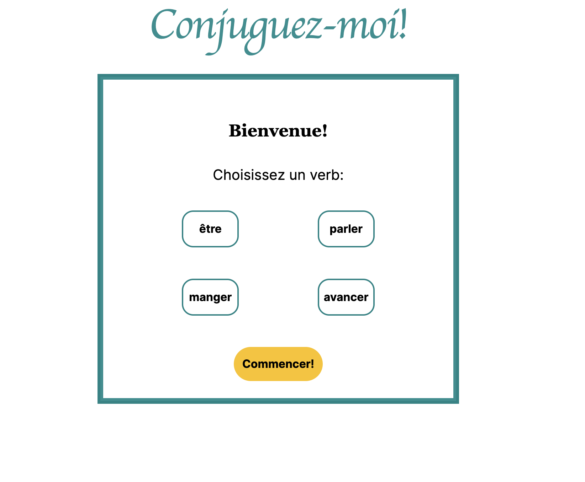

# Conjuguez-moi!

## Description

An app to help French-learners practice verb conjugations in the present tense.

## Table of Contents

- [Usage](#usage)
- [Contributing](#contributing)
- [License](#license)
- [Credits](#credits)
- [Questions](#questions)

## Usage

Choose the verb you wish to practice and click "commencer" to begin. If you have any difficulty adding accents, use the buttons above the answer blank to add them

## Contributing

Get in touch using the contact information below

## License

This project is licensed under the MIT license.
https://opensource.org/licenses/MIT

## Credits

<a href="https://iconscout.com/icons/fleur-de-lis" class="text-underline font-size-sm" target="_blank">Fleur De Lis</a> by <a href="https://iconscout.com/contributors/iconscout" class="text-underline font-size-sm" target="_blank">IconScout Store</a>

## Questions

Github: https://github.com/marysgreenwood
Email: marysgreenwood@gmail.com
